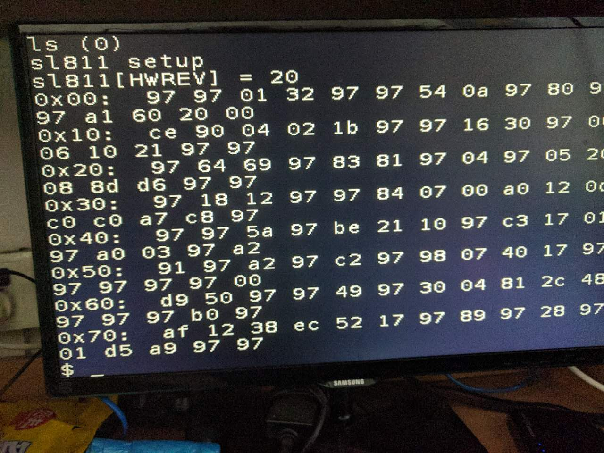
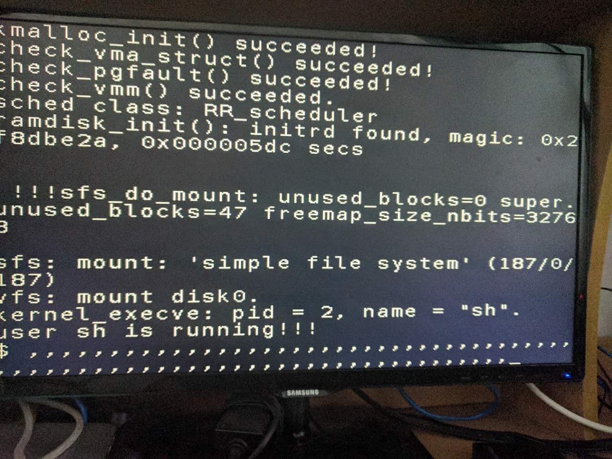

## neo-armcpu

## 终极目标
在新板子上复现 armcpu

#### 2017.07.21
- SL811 软件驱动
  - ucore 中断那部分代码貌似改动会炸
    - 总之改了中断处理部分代码之后, 还没跑到开中断, 在 proc_init 里就会触发 assert failed, initproc->pid != 1
    - 可能是跑到哪里造成了 reset, 然后由于内存没有被初始化, 导致 assert failed
    - (不知道是因为在中断处理程序里耗时太长会怎么样)
  - 最后的解决方案是把驱动放到一个用户态应用程序里, 启动时创建这个进程, 这个进程轮询获取 SL811 状态().

#### 2017.07.20
- SL811 软件驱动
  - 找李老师和@宇翔分别讨论了一下, 宇翔帮我用 naivemips 和 U-Boot 测了一下板子上的 SL811 是好的.
    - 在 U-Boot 里打印出他对 SL811 寄存器的读写, 发现我和 U-Boot 不同的地方在于, U-Boot 遇到 NAK 之后, 会重试发 packet, 试着这样弄, 发现终于能正常对键盘 GetDescriptor, SetDescriptor 等所有操作了!!
  - 测了一下之前实现的中断传输, 也是好的, 能读出键盘扫描码

- TODOs
  - 结构化 ucore 的 USB 驱动架构, 做一个 USB packet 队列
  - 把当前的轮询方式实现的键盘做成中断驱动的, 在时钟中断里(可以使 SL811那个 SOFTimer的中断)进行 USB transfer
  - 支持 USB Hub
  - 最终目标倾向于在 ucore 中搭建一套 USB 驱动框架, 如果还有剩余时间, 再去复现 @jiakai 的其余工作, 今后精力主要集中在 USB 框架部分.

#### 2017.07.19
- SL811 软件驱动
  - 添加 SL811 的 packet 请求队列, 在 DONE_A 中断之后可以从队列中取出 packet 发送
  - 发现原来的 GetDescriptor 在某些设备可用 有些设备不可用, 怀疑是 USB Frame 时序的问题, 明天试试用 SOF Timer 来同步时钟看看能不能解决这个问题.

#### 2017.07.18
- SL811 软件驱动
  - 继续实现了 SetAddress, GetConfigurationDescriptor, SetConfiguration,  GetStringDescriptor
  - 发现只有一个带 USB hub 的键盘和一个蓝牙适配器能工作, 戴尔 USB 鼠标能成功发 Setup packet, 戴尔键盘能手动发 Setup packet, 感觉比较奇怪, 调了一下午也没什么结果, 决定先把中断调通.
  - SL811 的中断信号是电平触发, 当 SL811 IntEnable 寄存器对应中断启用的时候, 发生指定中断 Int 会保持为 1, 直到 IntStatus 寄存器被清空, 而且清空 IntStatus 寄存器对对应位不是写 0, 而是 1!
  - 完成 SL811 最简单的 Inserted/Removed 中断的处理
- TODOs
  - 明天把 GetDescriptor 这样的操作用中断处理一遍试试

#### 2017.07.17
- SL811 软件驱动
  - 被 C 语言操作符优先级又坑了一次, & 优先级低于 ==, 反汇编了之后发现代码不存在, 被优化掉了, 是因为逻辑恒假, 查了优先级顺序才发现 bug.
  - 发现删掉打印语句后会导致 GetDescriptor 中的 IN packet 收到 NAK, 感觉应该是 SL811 现在轮训的方式不对, 可能换了中断就好了
  - 将代码模块化, 把各种 Magic Number 变成结构体和定义
  - 发现给结构体的成员变量赋值会导致 Kernal Panic, Illegal Instruction, 给这种结构体成员变量赋值的时候 gcc 会生成, sb 这种 armcpu 中没实现的指令. 用了一些 C语言 trick 进行对齐读写防止生成这种指令.

- USB 协议大体流程(HID 设备)
  - IN  GetDescriptor
  - OUT SetAddress
  - IN  GetDescriptor
  - IN  GetConfigurationDescriptor (First 9 bytes)
  - IN  GetConfigurationDescriptor (Descriptor set)
  - IN  GetStringDescriptor..
  - OUT SetConfiguration (Device Configured)
  - OUT SetIdle (Only respond to interrupts requests)

#### 2017.07.16
- SL811
  - 发现了时序上的 bug 和 rst_n 写反了, 改过来之后能顺利读 HWREV 寄存器, REV = 2
  - 
  - 开始调试写 SL811 寄存器
  - 终于调通了读写 SL811 寄存器, 用了 Vivado ILA 看板子上信号, 发现写入时的波形和读相同, 发现是 ucore 里写的时候忘设了一个 bit
  - 开始调研 USB 协议
  - 尝试实现一个最简单的 GetDescriptor 操作
  - 成功实现 GetDescriptor 操作

- TODOs
  - 代码重构, 把调试写的烂代码写成可复用的代码
  - 继续实现 SetAddress 等操作

#### 2017.07.15
- SL811
  - 在 Vivado 中仿真 SL811 的模块, 功能是将 SL811 的读写分别映射到两个内存地址
  - 这样的好处就是和 Linux 下的 SL811 驱动实现的方法类似, 易于将 Linux 下的驱动移植过来
- 存在问题
  - SL811 的时序图有些不敢确定, 之后根据时序图再修改一下读写 SL811 的等待时间
  - 加上 SL811 之后 会出现 AlignmentError


#### 2017.07.14
- 键盘
  - 在 ucore 测试了通过串口写入 ASCII 码可以正常使用 shell
  - 打算走软件实现 sl811 驱动程序这个方向, 先实现软件读写 sl811 的寄存器
  - 调通了读 sl811 寄存器功能, 明天把写加上

#### 2017.07.13
- USB 键盘
  - 首先看一下 sl811-hcd.c 里面发现 USB 设备的代码, 找到了一块简单的获取设备版本号的代码, 感觉可以先实现一下, 试着读出版本号, 写到串口
  - 只要稍微修改实例读写串口就会挂, 发现是 PC 端读写串口不对, `echo/cat` 读写串口不靠谱, 赶快用 `screen /dev/ttyACM0 115200` 吧
  - 尝试参照 sl811-hcd.c 和 sl811 的手册, 初始化 sl811, 设置中断模式, 在这上面浪费了一天, 感觉这条路不通(至少时间不允许), 打算先做串口虚拟键盘
- TODOs
  - USB 太复杂了, 如果遇到瓶颈感觉可以先用串口做一个一个虚拟键盘出来
  - 想做虚拟键盘需要修改 ucore 需要看一下他们的 ucore 怎么 build
    - 直接 make
      - 遇到问题, 有几处路径的小问题, 改之
      - 编译通过, 检查一下 gcc 生成的指令, `mipsel-linux-gnu-objdump -d ../ucore/obj/mm/vmm.o   | awk '{print $3}' | sort | uniq | grep -E "^[a-z]+\$"`, 对比他们之前生成的 ucore
      - 发现多了 3 条指令 `lwl, lwr, bal`, 查了一下是用来做非对其访存的
      - 用这条命令找到那些文件中多余了这些指令

      ```
      #!/bin/bash
        for file in $(find obj -type f); do
          if mipsel-linux-gnu-objdump -d $file   | awk '{print $3}' | sort | uniq | grep -E "^[a-z]+\$" | grep -E "lwl|lwr|bal" > /dev/null; then
            echo "file: " $file
          fi
        done
      ```
      - 发现只有 user app 和 ramdisk.o 中有, 详细看一下 build 这两部分的 Makefile
      - 结果换了 mips-sde-elf 工具链就好了

#### 2017.07.12
- VGA 方向
  - 暂时先用低频率凑合
  - Vivado 里加上 timing constraints 50MHz, VGA能成功在 50MHz 显示了, 但是结果是一下出来, 而不是一行一行出来
- 键盘方向
  - 先写了一个用 touch_btn 控制的键盘, 测通后再弄 USB
  - 研究了一下 sl811 的用法, 觉得需要调研一下 sl811 在 Linux 下的驱动和 USB HID 协议. 有两条路线.
    - 可以试着把 Linux 下的 sl811 驱动移植到 ucore, 这样, 在硬件层面不需要做太多事情.
    - 可以试着用硬件实现 sl811 驱动的一个子集 (只需要读键盘输入就好了), 这样不用改软件.
- ucore 方向
  - 能进入 ucore 了, 但是 kernel panic, invalid pa
  - 怀疑是不是频率太低导致的, 先用高频率时钟启动, 等一会之后再将始终拨慢, 成功进入 Shell, 键盘也可以工作 (这些逗号是用 touch_btn 输入的, 字符在代码里写死了是逗号, >__<)
    

- TODOs
  - VGA, 一下出来的 bug
  - 键盘, 支持 USB 键盘
  - ucore, 应该不需要有太大修改了
  - flash, 之后试一下从 Flash 启动
  - 可以试着用一下 Vivado ILA 调试

#### 2017.07.11
- 在旧板子复现 armcpu
  - 找 @李山山 老师要了几块老板子, 没有一块能正常工作, 最好的情况是能进 ucore 但是按键盘任意按键 Kernel Panic.
    - 这条路不通了, 暂时到这.

- 继续找 VGA 没有显示的问题
  - 首先发现了 Flash 读写的信号有所不同, 对着代码改了一下, 还是没有显示
  - 把 instr_addr 显示出来, 发现开机在 0x80000080 ~ 0x8000008C 死循环了
  - 把 instr_data 显示出来, 发现 CPU MMU 中读到的 baseram 的高 8 位都是 1(其余没看)
  - 修改 @宇翔 提供的 serial_load.py, 添加了读内存功能, 读一下内存, 发现读出的是正常的 ucore, 怀疑是内存读写信号有问题.
  - 新板子提供的 toplevel 中, ram_oe, ram_we 等信号叫做 ram_oe_n, .. 本来以为是和 armcpu 中是反的, 擅自加了个 '~', 删掉.
  - 能进入 ucore, 但是 VGA 有问题, 必须将时钟降低到几十 K 的时候才能正常显示, 能进入 Shell

- TODOs
  - 搞清楚新板子内存信号的定义
  - 解决 VGA 高频率时抖动黑屏问题

#### 2017.07.10
- 将新版 toplevel 放进 armcpu, 把原来的 armcpu 作为一个 module
  - ISE 升级到 Vivado 遇到的一些坑
    - IP Core 需要升级, 旧版的不能直接拿来用
    - 需要修改一下 FPGA 的型号
  - 在 @宇翔 帮助下, 成功烧入 ucore 到 Flash, 2KB/s
    - 坑
      - 上电
      - 烧入 soc_toplevel.bit
      - 设置 baudrate
      - 要把最右面拨码开关置0
      - 刷入
    - 顺便用 NaiveBootloader 验证了内存和 Flash 正常工作
  - 尝试直接包一层 toplevel 之后直接烧入新版子, 无法启动 ucore, 想先从在旧板子上复现开始着手.

## Long Term Goals
- ~~修改 armcpu 能在新板子上有 VGA 显示~~
- ~~先用 verilog 写一个假的键盘, 用拨码开关控制, 能在 Shell 中打印出字符.~~
- 添加 USB 键盘支持
- 调研 armcpu 上的那些扩展怎么跑起来
  - 图片渲染
  - 贪吃蛇

## Reference
- [@jiakai 项目](https://git.net9.org/armcpu-devteam/armcpu)
- [Linux sl811 Driver](https://github.com/torvalds/linux/blob/5924bbecd0267d87c24110cbe2041b5075173a25/drivers/usb/host/sl811-hcd.c)
- [Cypress SL811HS Manual](http://www.cypress.com/file/126236/download)
- [USB in a Nutshell](http://www.beyondlogic.org/usbnutshell/usb1.shtml)
- [USB Made Simple](http://www.usbmadesimple.co.uk/index.html)
- [USB 协议 - 深入理解](http://blog.csdn.net/myarrow/article/details/8484113)
- [USB SetAddress Packet](http://www.microchip.com/forums/m228309.aspx)
- [Wireshark USB Filter](https://www.wireshark.org/docs/dfref/u/usb.html)
- [USB HID Protocol](https://docs.mbed.com/docs/ble-hid/en/latest/api/md_doc_HID.html)
- @张宇翔
